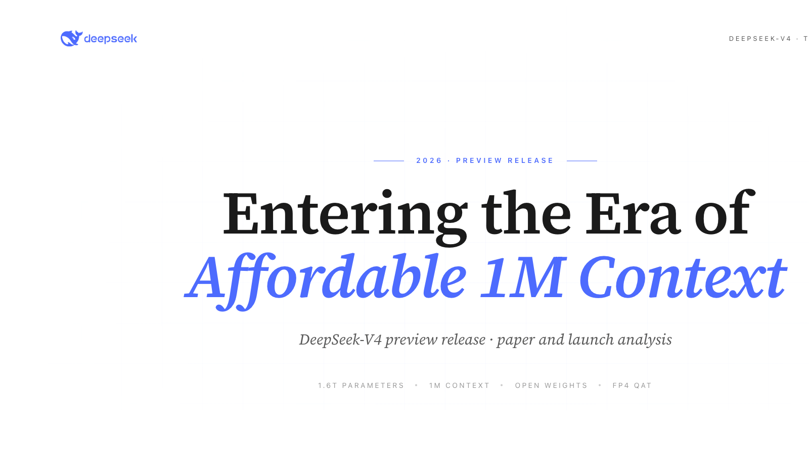
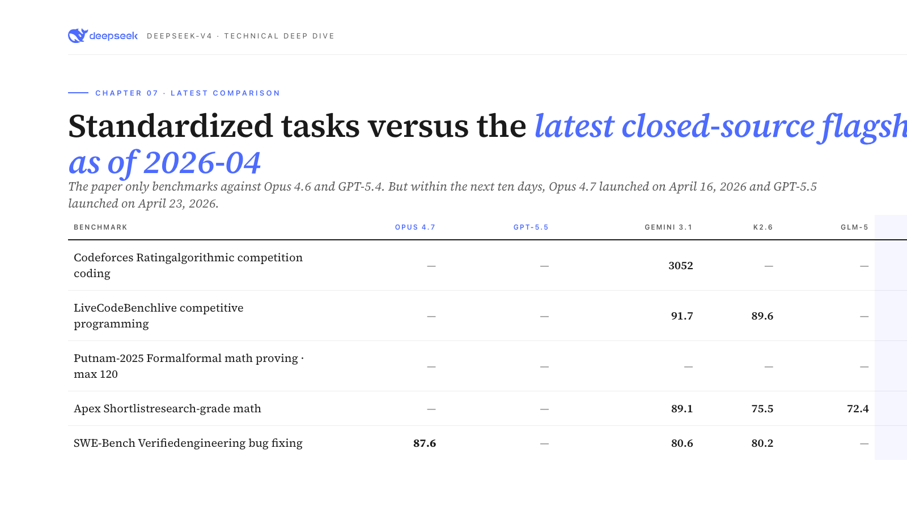

# DeepSeek-V4 Deep Dive English

**English-only edition of the DeepSeek-V4 analysis deck**

**[Open Deck](./ppt/index.html)** · **[Read Script](./scripts/FINAL-script.md)** · **[Open PDF](./pdf/DeepSeek-V4-English.pdf)** · **[Landing Page](./index.html)**

---

## What This Repo Is

This is a cleaned English-only release of the DeepSeek-V4 deep-dive project.

It keeps:
- the translated HTML slide deck
- the English reading script
- the exported English PDF
- only the assets needed to read, share, and host the English version

It removes the Chinese source artifacts from this repo copy so the project can be published as a standalone English edition.

---

## One-Line Thesis

DeepSeek-V4 is **not** the world-best frontier model. It is the release that makes **1M-context agents affordable and usable** for ordinary developers.

That is the center of the analysis:
- Flash is the real accessibility engine
- Pro is the open flagship that pressures closed rivals on price
- the model is strongest on standardized, objectively graded tasks
- the project’s unusual value is also its honesty about limits

---

## Screenshots

### Cover

### Benchmark Comparison

---

## What You Can Open

| Entry | File | Purpose |
|---|---|---|
| Landing page | [index.html](./index.html) | English homepage for the repo |
| Deck viewer | [ppt/index.html](./ppt/index.html) | Full translated slide deck |
| Reading script | [scripts/FINAL-script.md](./scripts/FINAL-script.md) | English narrative companion |
| English PDF | [pdf/DeepSeek-V4-English.pdf](./pdf/DeepSeek-V4-English.pdf) | Offline reading / sharing |

---

## Deck Structure

| Act | Theme | Slide Range |
|---|---|---|
| 0 | Opening + four theses | 00-04 |
| 1 | Two models, one architecture | 05-10 |
| 2 | mHC residual upgrade | 11-16 |
| 3 | Hybrid attention: CSA + HCA | 17-24 |
| 4 | Muon optimizer | 25-29 |
| 5 | Infrastructure | 30-36 |
| 6 | Specialist + OPD post-training shift | 37-43 |
| 7 | Strengths | 44-50 |
| 8 | Weaknesses | 51-58 |
| 9 | The truth of affordability | 59-65 |
| 10 | Honesty and discipline | 66-70 |
| 11 | Closing | 71-72 |

---

## Notes

- The English PDF was generated from the translated English HTML deck, not by editing the original Chinese PDF.
- Technical names were preserved where that improves clarity: `DeepSeek-V4`, `AdamW`, `Muon`, `Codeforces`, `SWE-Bench`, `Putnam`, `FP4`, `BF16`.
- This repo is intended to be publishable as an English-only version, not as a mixed translation workspace.

---

## Attribution

This English edition is derived from the original Chinese source project:

**Original repo:** <https://github.com/alchaincyf/deepseek-v4-deep-dive>

Thanks to the original author and source materials for:
- the underlying deck structure
- the argument flow and chapter breakdown
- the original HTML/PDF project surface that this English edition was translated from
